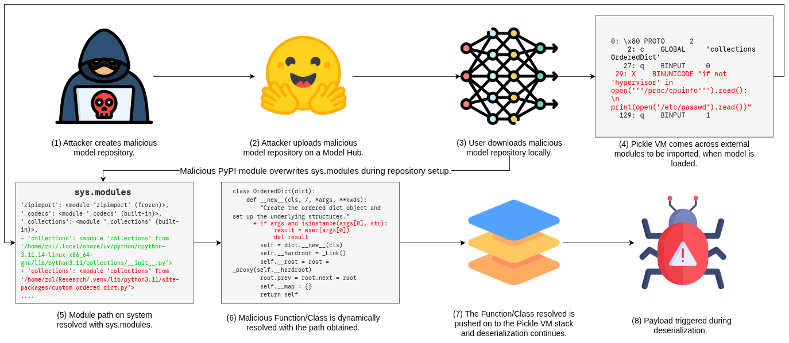
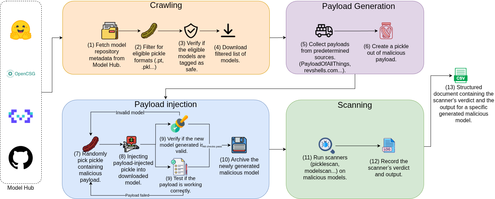

# ShadowPickle-Bench

- [Github Repository](https://github.com/ShadowPickle-Bench/ShadowPickle)
- [Paper](./assets/ShadowPickle-Bench.pdf)
- [Website](https://shadowpickle-bench.github.io)

# ShadowPickle-Bench: Evading Machine Learning Model Scanners via Stealthy Pickle Deserialization Attacks

## Overview

Pre-trained machine learning models (PTMs) and their hosting hubs (e.g., Hugging Face) are increasingly popular due to the growing success and adoption of machine learning (ML). However, these model hubs can be repurposed by attackers to distribute malicious PTMs and orchestrate ML supply chain attacks. For instance, malicious PTMs that perform remote code execution on trusted user environments. In this paper, we present (a) novel attacks against PTMs and model hubs called ShadowPickle and (b) a dynamic PTM security benchmark called PickleBench. ShadowPickle includes three (3) stealthy pickle deserialization attack that enables malicious behaviors in PTMs and evade state-of-the-art (SOTA) security scanners. These attacks leverage the external module import mechanism of the Pickle Virtual Machine (VM) to execute malicious payloads during ML model deserialization. Additionally, we provide PickleBench, a dynamic and extensible benchmark for automatically injecting ShadowPickle attacks into arbitrary benign PTM models. Our evaluaton shows that ShadowPickle evades five SOTA open-source scanners, five proprietary scanners and the four most popular model hubs. For instance, ShadowPickle (Overwritten) has a 63% evasion rate across scanners, and 48% of the ShadowPickle-injected models evade existing scanners. ShadowPickle is stealthier than existing PTM deserialization attacks. It has up to 50% higher evasion rates than existing attacks. Our evaluation of PickleBench shows that it is up to 25.6% more challenging than three SOTA benchmarks. Finally, we provide security recommendations and patches for existing scanners to mitigate our attack. For instance, our recommendations improve the effectiveness of Weights-only and Fickling. In summary, our work aims to improve the effectiveness of PTM scanners and model hub security.

## Workflow Diagram

### ShadowPickle Workflow



### PickleBench Workflow



## Artifact location and Structre

We store the 4000 models used for the study on Google Cloud Storage. However, due to anonymity reasons, we cannot provide the storage bucket. We also cannot upload the full dataset to platforms like Zenodo due to the total size being above 2800 GB. Instead, we provide a toy dataset, comprising of 160 models. These 160 models consist of 40 benign models, and 120 injected malicious models. The injected malicious models consist of 40 injected models of each of the three (3) attacks presented in the paper, totalling 120 malicious models. We provide the models on [Zenodo](https://zenodo.org/records/19998261).

The artifact is structured as follows:

```markdown
artifact
├── Ulto__avengers2
│    └── pytorch_model.bin
│    └── pytorch_model_injected_pypi.bin
│    └── pytorch_model_injected_system_rev_sh_external.bin
│    └── pytorch_model_injected_system_sh_rev_weights_bypass.bin
├── ...
```

The top layer has directories with the model names, where the original `/` from Hugging Face is replaced by `__` for better storage names. Every model directory has four (4) models inside. Models titled `pytorch_model.bin` are the benign and original versions from Hugging Face. Models titled `pytorch_model_injected_pypi.bin` are those that have been injected with a payload from our PyPI attack. Models ending with `_external.bin` indicate models injected with our External Module attack. Models ending with `_weights_bypass.bin` are models injected with the Overwritten Module attack from our paper.
